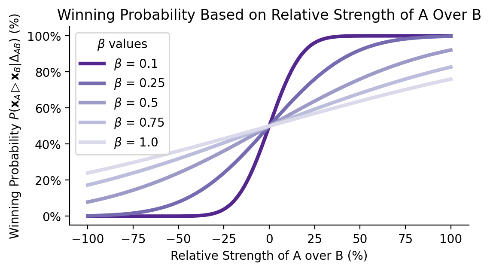

How to rate players in a competitive game by leveraging data ?

Skill ratings in competitive games and sports serve several key purposes.
First, they enable players to be matched with others of similar skill, creating engaging, balanced matches.
Second, these ratings can be shared with players and the public, sparking interest and fostering competition (think ELO in chess).
Third, with the rise of online gaming, interest in rating systems has surged, as they impact the daily online experience of millions of players worldwide.

With the vast amount of sports and events, it is difficult if not impossible to accurately rate the skill of players withtout automatic approaches.
What better approach to rate the skill of players that leveraging the record of wins, draws and losses to automatically asses their skill.

Rating models in their simple form generaly assume that a player $A$ has a  **strengh** $s_A$, and that the higher the difference in strengh with a player $B$ the larger the probability of winning a match $P\left(\mathbf{x}_A \triangleright \mathbf{x}_B | s_A, s_B\right) = f(s_A - s_B)$. 
A subtile yet important common assumption (implied by our previous statement) is that only the skill gap impacts the probability of winning and not directly the absolute magnitude of the skill.

In summary, skill ratings generally assumes: 
- $ \textcolor{blue}{\raisebox{.5pt}{\textcircled{\scriptsize 1}}} $ Any player has an underlying strengh (or skill level)
- $ \textcolor{blue}{\raisebox{.5pt}{\textcircled{\scriptsize 2}}} $ Probability $A$ wins over $B$ is a fonction of the difference in strengh (skill gap):
$$
P\left(\mathbf{x}_A \triangleright \mathbf{x}_B | s_A, s_B\right) = f(s_A - s_B)
$$

Those two core assumptions underpins the majority of the skill rating approaches. 
As we will see, each approach will require a bit more hypothesis about the influence of the skill gap and the probability of wins.

To ease the derivation, let's note the skill gap $\Delta_{AB} = s_A - s_B$

## ELO Rating Model
---

The ELO rating model is a statistical approach famous to be adopted by World Chess Federation (FIDE).
ELO adds another hypothesis upon  $ \textcolor{blue}{\raisebox{.5pt}{\textcircled{\scriptsize 1}}} $ and $ \textcolor{blue}{\raisebox{.5pt}{\textcircled{\scriptsize 2}}} $: 

- $ \textcolor{red}{\raisebox{.5pt}{\textcircled{\scriptsize 2}}}$ Probability of A wins over B is given by 
$$ f(\Delta_{AB}) = \Phi\left(\frac{\Delta_{AB}}{\sqrt{2} \beta}\right) $$
with $\Phi$ is the cumulative density of a zero-mean unit-variance Gaussian. 

In this case $ \textcolor{red}{\raisebox{.5pt}{\textcircled{\scriptsize 2}}}$ is more than a hypothesis but it describes functionally the relationship between the **skill gap** and the probability of winning.
As such, it builds upon our previous hypothesis $ \textcolor{blue}{\raisebox{.5pt}{\textcircled{\scriptsize 2}}} $.

**Model Update**. Given a model of the probability of winning based on the difference of skills, how to update the skill of both players after observing of win (lose or draw) ?

To understand how to update this model, it is useful to make a detour by the specification of  full (bayesian) data generative process.
This specification is the hypothesis space upon which we believe the observations are generated. 
In our case, the foundation are our hypothesis about the process and be revised to derive different method. 
In this case,  

- $ \textcolor{blue}{\raisebox{.5pt}{\textcircled{\scriptsize 1}}}$ Each player $i$ has an underlying skill level $s_i$. In the Bayesian Framework, those unobserved skill level are assume to be normal random variable.
$$
s_i \sim \mathcal{N}\left(\mu_i, \sigma_i^2\right)
$$
Those are called prior that reflect our knowledge before any observation. 
Here, we simply assume that the skill of a player is distributed around a skill level $\mu_i$ but can fluctuate with a standard variation of $\sigma_i$.

- $ \textcolor{blue}{\raisebox{.5pt}{\textcircled{\scriptsize 2}}} $ Probability $A$ wins over $B$ is
$$
P\left(\mathbf{x}_A \triangleright \mathbf{x}_B | \Delta_{AB}\right) = \Phi\left(\frac{\Delta_{AB}}{\sqrt{2} \beta}\right)
$$

Using the Bayes Formula, we have the strengh of player $A$ conditioned to a wins:
$$
P\left(s_A \mid \text { A wins }\right) \propto P\left(\mathrm{~A} \text { wins } \mid s_A, s_B\right) \cdot P\left(s_A\right) 
$$

The main issue is that the probability of winning is a non-linear function of the skill gap.
And unfortunately, the cumulative density function of a Gaussian is not linear neither and nasty to write:
$$
\Phi\left(\frac{x-\mu}{\sigma}\right)=\frac{1}{2}\left[1+\operatorname{erf}\left(\frac{x-\mu}{\sigma \sqrt{2}}\right)\right]
$$
But this may not be the end of the world.
If a function is non-linear, we can always approximate it by a linear one by using a first order taylor expansion.

... TODO Derive deeply

$$
\Phi\left(\frac{\Delta_{AB}}{\sqrt{2} \beta}\right) \approx \Phi\left(\frac{\mu_A-\mu_B}{\sqrt{2} \beta}\right)+\frac{1}{\sqrt{2 \pi} \beta} e^{-\frac{\left(\mu_A-\mu_B\right)^2}{4 \beta^2}} \cdot\left(s_A-\mu_A-\left(s_B-\mu_B\right)\right) .
$$
Pluggins this nasty beats into the bayesian formula, we get:
$$
\small{P\left(s_A \mid \text { A wins }\right) \propto\left[\Phi\left(\frac{\mu_A-\mu_B}{\sqrt{2} \beta}\right)+\frac{1}{\sqrt{2 \pi} \beta} e^{-\frac{\left(\mu_A-\mu_B\right)^2}{4 \beta^2}} \cdot\left(s_A-\mu_A-\left(s_B-\mu_B\right)\right)\right] \cdot P\left(s_A\right) .}
$$
which can be simplified to
$$
\propto\left[\text { constant }+\frac{1}{\sqrt{2 \pi} \beta} e^{-\frac{\left(\mu_A-\mu_B\right)^2}{4 \beta^2}} \cdot\left(s_A-\mu_A\right)\right] \cdot \exp \left(-\frac{\left(s_A-\mu_A\right)^2}{2 \sigma_A^2}\right) 
$$

Ok so this is a big mess. 
But we can simplify even more using : 

$$
P\left(s_A \mid \mathrm{A} \text { wins }\right) \propto\left[C+\alpha \cdot\left(s_A-\mu_A\right)\right] \cdot \exp \left(-\frac{\left(s_A-\mu_A\right)^2}{2 \sigma_A^2}\right),
$$

where:
- $C=\Phi\left(\frac{\mu_A-\mu_B}{\sqrt{2} \beta}\right)$ is the constant term,
- $\alpha=\frac{1}{\sqrt{2 \pi} \beta} e^{-\frac{\left(\mu_A-\mu_B\right)^2}{4 \beta^2}}$ is the scaling factor for the linear term.

Perfect, now let's try to derive the expectation of the "linearized" skill of player $A$ given that he won.

1. **Rewrite the Posterior**: Expanding the term $\left[C+\alpha \cdot\left(s_A-\mu_A\right)\right]$ inside the posterior, we have:

$$
P\left(s_A \mid \mathrm{A} \text { wins }\right) \propto C \cdot \exp \left(-\frac{\left(s_A-\mu_A\right)^2}{2 \sigma_A^2}\right)+\alpha \cdot\left(s_A-\mu_A\right) \exp \left(-\frac{\left(s_A-\mu_A\right)^2}{2 \sigma_A^2}\right) .
$$

The posterior now consists of two terms:
- A Gaussian term centered at $\mu_A$,
- A term that linearly shifts $s_A$ weighted by $\left(s_A-\mu_A\right)$, also centered around $\mu_A$.

2. **Expectation Calculation**: Since the first term $C \cdot \exp \left(-\frac{\left(s_A-\mu_A\right)^2}{2 \sigma_A^2}\right)$ is symmetric around $\mu_A$, its contribution to the mean is $\mu_A$. The second term $\alpha \cdot\left(s_A-\mu_A\right) \cdot \exp \left(-\frac{\left(s_A-\mu_A\right)^2}{2 \sigma_A^2}\right)$ represents a shift from $\mu_A$.

The mean of this posterior distribution will be approximately:

$$
\mathbb{E}\left[s_A \mid \mathrm{A} \text { wins }\right] \approx \mu_A+\frac{\alpha \cdot \sigma_A^2}{\sqrt{2 \pi} \sigma_A} e^{-\frac{\left(\mu_A-\mu_B\right)^2}{4 \beta^2}},
$$

where $\alpha \cdot \sigma_A^2$ captures the contribution from the linear term in shifting $\mu_A$ based on the observed outcome.

**Lemma**. For a random variable $X \sim \mathcal{N}\left(\mu, \sigma^2\right)$, the expectation of $(X-\mu) \cdot f(X)$, where $f(X)$ is symmetric about $\mu$, is approximately $\sigma^2 f^{\prime}(\mu)$.

# TODO